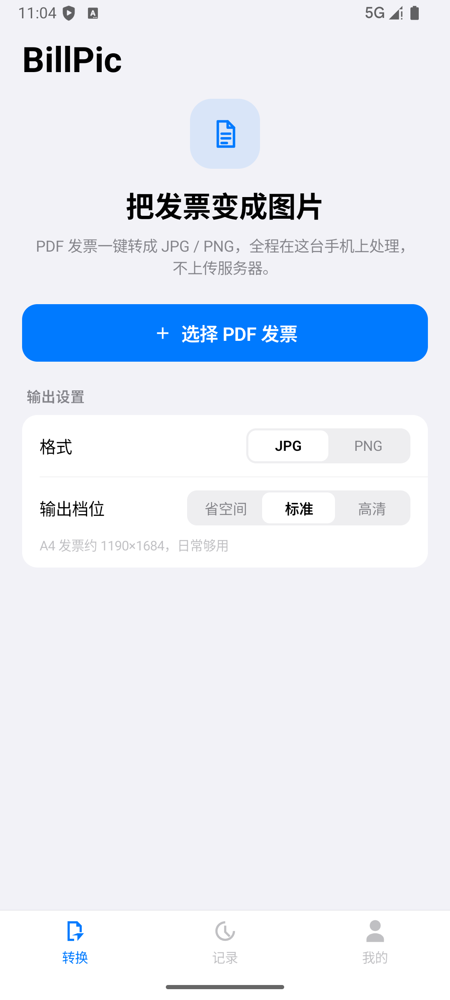
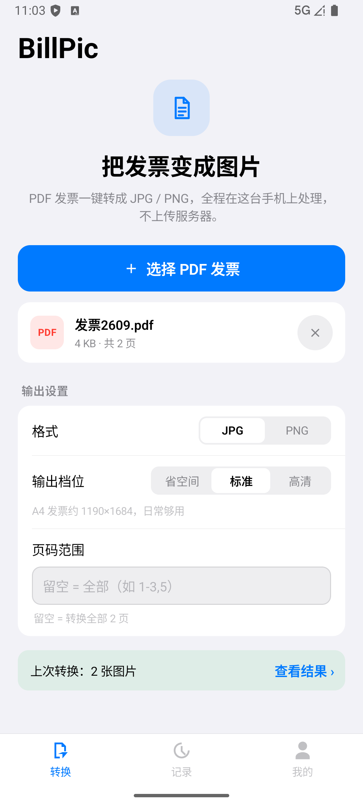
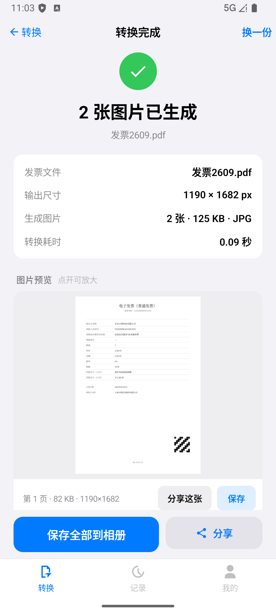
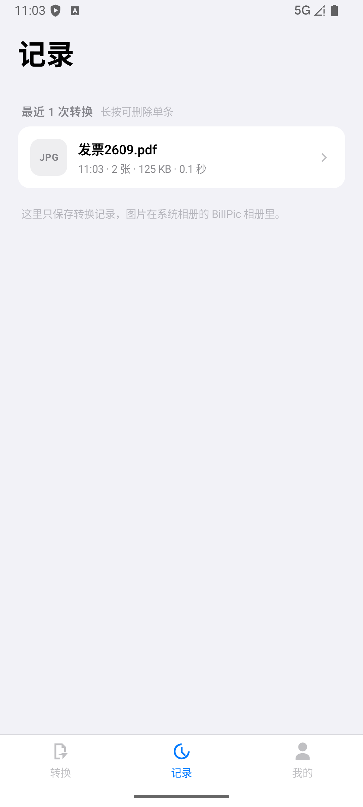
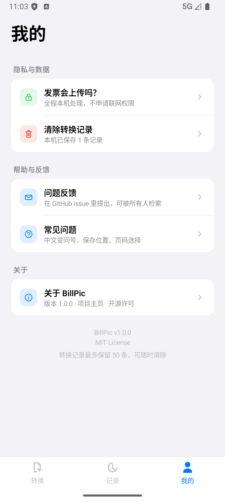
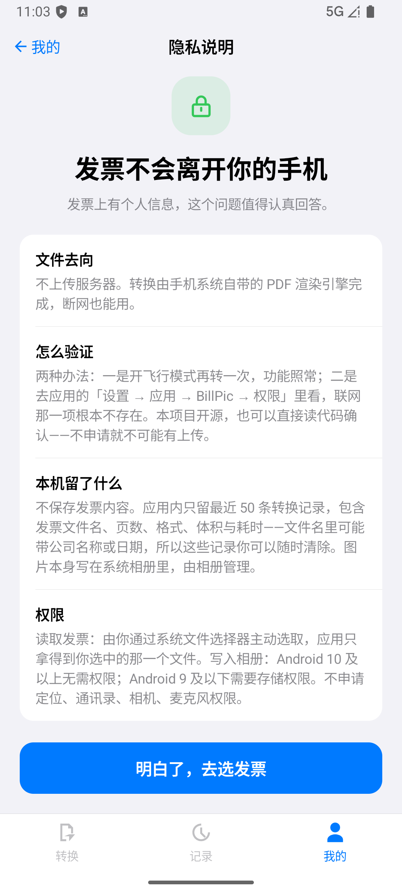

# BillPic

把 PDF 发票转成 JPG / PNG 图片的 Android 应用。**全程在本机完成，不申请联网权限。**

> *BillPic turns PDF invoices into JPG/PNG images entirely on-device. It is built with
> Jetpack Compose and the system `PdfRenderer` — no third-party PDF library, and
> deliberately **no `INTERNET` permission**: the privacy promise is enforced by the
> platform rather than by policy.*
>
> **Keywords:** Android · Kotlin · Jetpack Compose · PdfRenderer · invoice · offline · no-network

---

## 它解决什么问题

电子发票大多是 PDF，但报销系统、微信、邮件常常只收图片——于是每次都要截图、裁边、对不齐。
BillPic 只做一件事：选一份 PDF 发票，转成图片，存进相册或直接分享。

发票上有个人信息，所以这个应用从设计上就**不具备把文件传出去的能力**。

## 截图

| 转换 | 多页 PDF 等待确认 | 转换结果 |
|---|---|---|
|  |  |  |

| 转换记录 | 我的 | 隐私说明 |
|---|---|---|
|  |  |  |

## 特点

- **不联网是结构性事实**：`AndroidManifest.xml` 里根本没有 `INTERNET` 权限。
  开飞行模式功能照常，也可以在系统「应用权限」页确认这一项不存在。
- **零第三方 PDF 依赖**：使用系统自带的 `PdfRenderer` 逐页渲染，APK 小、启动快，也没有第三方库的漏洞面。
- **体积可控**：报销平台常有上传大小限制，所以输出档位是按**体积**取向设计的
  （省空间 / 标准 / 高清），同时控制渲染倍数与 JPEG 质量两个杠杆。
  同一页 A4 发票「标准」档约 42 KB，「省空间」档约 16 KB。
- **可选页码范围**：一份 PDF 里常常只有某一页是你的，可以直接只转那几页。
  输入容错做得较宽：中文逗号、顿号、全角数字都接受，区间写反（`4-2`）自动纠正。
- **代码量小**：24 个 Kotlin 文件 / 约 4100 行，读完不需要很久。

## 安装

### 直接安装 APK

到 [Releases](../../releases) 下载 `app-release.apk`，在手机上允许「安装未知来源应用」后安装。

- 支持 Android 7.0（API 24）及以上
- release 包约 1.2 MB

### 自行构建

需要 JDK 17+ 与 Android SDK Platform 36。

```bash
git clone https://github.com/mengsanye/bill-pic.git
cd bill-pic

./gradlew assembleDebug      # 调试包
./gradlew assembleRelease    # 发布包（R8 压缩，约 1.2 MB）
./gradlew testDebugUnitTest  # 单元测试
```

产物在 `app/build/outputs/apk/`。

未配置签名时 release 会回退到 debug 签名，因此 clone 下来即可构建；若要对外分发，
把 `keystore.properties.example` 复制为 `keystore.properties` 并填入四项即可（该文件已被 `.gitignore` 排除）。

## 使用

1. 点「选择 PDF 发票」，在系统文件选择器里选一份 PDF——应用只拿得到你选中的那一个文件
2. 单页 PDF 直接转换；超过一页会停下来，让你先确认页码范围
3. 在结果页逐页预览、单张保存、保存全部到相册，或直接分享到微信 / 邮件

## 技术实现

### 技术栈

| | |
|---|---|
| 语言 | Kotlin |
| UI | Jetpack Compose + Material 3（单一 Activity） |
| 架构 | 单一 `MainUiState` + `StateFlow` 作为唯一数据源；不引入 Navigation / Hilt / Room |
| PDF 渲染 | 系统 `PdfRenderer`（零第三方依赖） |
| 相册写入 | `MediaStore`（API 29+ 用 `IS_PENDING`；24–28 写公共目录 + `MediaScanner`） |
| 选文件 | SAF（`ActivityResultContracts.OpenDocument`），因此无需任何读取权限 |
| 分享 | `FileProvider` + `ACTION_SEND` |
| 持久化 | `SharedPreferences` + `org.json`（最多 50 条记录元信息） |
| 测试 | JUnit（`PageRange` 解析逻辑，10 个用例） |

### 工程结构

```
app/src/main/java/com/next/billpic/
├── MainActivity.kt                入口（edge-to-edge）
├── core/
│   ├── model/                     领域模型、可调参数、页码范围解析
│   ├── pdf/PdfConverter.kt        PdfRenderer 逐页渲染 + 尺寸/显存保护
│   ├── io/PickedFile.kt           SAF Uri → 缓存文件（保证可随机读取）
│   ├── media/MediaSaver.kt        写相册 / 分享 / 打开相册
│   ├── data/UserDataStore.kt      转换记录与输出偏好
│   └── util/Images.kt             采样解码 + 格式化
└── ui/
    ├── MainViewModel.kt           全部交互（唯一数据源）
    ├── BillPicApp.kt              Scaffold + 底部 Tab + 弹层编排
    ├── components/                自绘控件（分段控件、进度环、HUD、列表行…）
    ├── screens/                   转换 / 结果 / 记录 / 我的 / 隐私 / 常见问题 / 关于
    ├── sheets/                    全屏看图（双指缩放至 8 倍）
    └── theme/                     设计令牌与文字样式
```

想改产品行为时先看 `core/model/AppConfig.kt`——页数上限、渲染保护、主按钮文案、项目链接都在里面。

### 几个刻意的取舍

**不引入 Navigation / Hilt / Room。** 只有四个主屏、一个数据源、数据量最多 50 条元信息。
引入这三个库带来的间接层，比它们解决的问题更多。

**分段控件与底部 Tab 自绘。** Material 的对应组件用 `secondaryContainer` 表达选中态，
与既定的蓝色选中态不一致；自绘可以精确控制，也顺带避免了实验性 API 依赖。

**选完文件才决定是否自动转换。** 单页 PDF 没有可配置的东西，选完直接转；
超过一页时停下来让用户先确认页码——因为页码设置到这一刻才第一次有意义。
先按默认值转完再让用户修改，等于让他「修正」而不是「配置」。

**输出档位按体积取向命名。** 报销场景真正的拦路虎不是不够清晰，而是平台有上传大小限制、转出来传不上去。

应用图标的设计推导（以及几个被否掉的方案和原因）记在 `ic_launcher_foreground.xml` 的注释里。

## 隐私

- **不申请联网权限**，应用不具备把数据传出去的技术途径
- 发票文件只在你选中它的那一次被读入应用缓存，转换完成后可清除
- 转换结果写到系统相册，由相册管理
- 应用内只保留最近 **50 条**转换记录（含发票文件名、页数、格式、体积、耗时），
  可在「我的 → 清除转换记录」中随时删除
- **转换记录被排除在系统云备份之外**——云备份会把数据上传到用户的 Google 云盘，
  与上面这条承诺冲突。手机间直传不经过网络，因此保留；代价是 Android 11
  及以下的机型无法区分这两条通道，换机时会丢掉这份历史（仅 50 条元信息）

## 已知限制

- **不做 OCR，也不做发票真伪校验**——它只是把 PDF 忠实渲染成图片
- 单次最多转 30 页；单边不超过 4096 px、总像素不超过 1200 万（防止老机型 OOM）
- 加密 / 损坏的 PDF 会给出明确的失败提示，不做静默处理
- 界面与文档目前只有中文
- 尚无 CI：测试需要在本地跑 `./gradlew testDebugUnitTest`

## 参与贡献

提交信息遵循 Conventional Commits，完整的格式、类型与 scope 清单见 [`CONTRIBUTING.md`](CONTRIBUTING.md)。
要点：`<type>(<scope>): <subject>`，纯英文、祈使句、首字母小写，
一个提交只做一件事，且不留编译不过的中间态。

发现问题或有建议，直接开 [issue](../../issues)。

## 许可证

[MIT](LICENSE) © 2026 BillPic contributors
